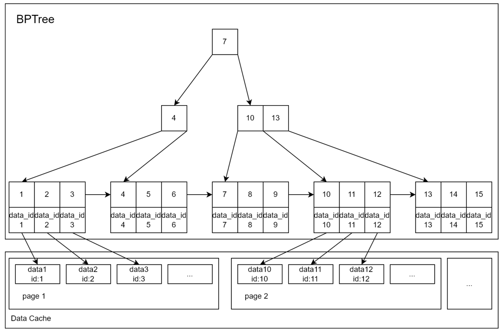
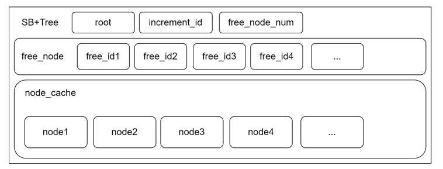

# Aurora

​	A B+tree with data stored on disk, using Cache and LRU elimination strategies to reduce I/O counts.

​	It is my data structure course design. இ௰இ

## Run

Use Visual Studio to open the project `Aurora.sln` file, compile it and run it. 

Enjoy it. :D

Or run Aurora.exe directly from the Debug or Release folder using the console

```bash
cd .\Release
.\Aurora.exe
```

## Principle

It is a fixed-table simple database based on a B+ tree as a data index and comes with cache in terms of file reads and writes. I think this project provides a good example of a B+ tree with data persistence.



A Cache is also present in this serializable B+ tree to store the nodes on disk.


